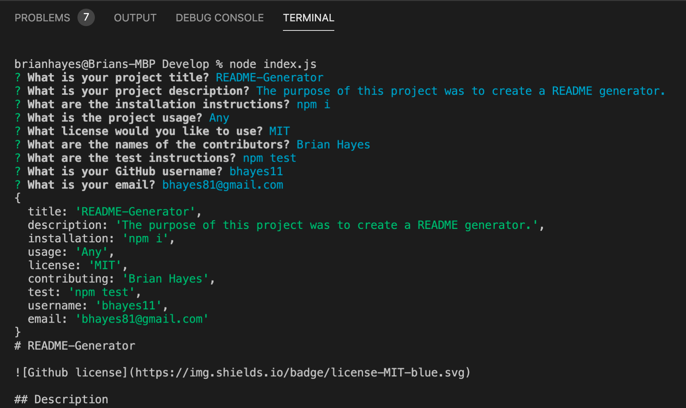

# README-Generator

## Description

The purpose of this project was to dynamically generate a high-quality README by using a command-line application. 

## Table of Contents
- [Demo](#Demo)
- [Screenshot](#Screenshot)
- [Built With](#Built%20With)
- [License](#License)

## Demo

## Screenshot

## Built With

* JavaScript

## License
[MIT](https://choosealicense.com/licenses/mit/#) License